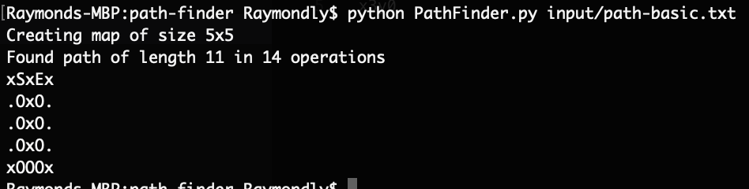

# Path Finder

## How to test the algorithm

Ensure python is installed.

1. Python package "pathfinding" is used, which can be installed with the command `pip install pathfinding`

1. Run the program using the following command replacing the path to the input you want to hash: `python PathFinder.py input/path-basic.txt`
 
1. After running, there should be a new file prefixed with .answer containing the generated hash to 
`input/path-basic.txt.answer`.



## Problem
Create a map and then find the shortest path from a 
start location to an end location. Think of it as being a pirate in search of 
treasure.

The input file, a coded message left behind by a fellow pirate, contains 
comma-separated coordinates, which detail your starting location, the location 
of the treasure, and the locations of dangerous reefs on the ocean, that you 
cannot sail over. The first correctly formatted coordinate in a file is your 
starting position, and the last correctly formatted coordinate is the location 
of the treasure. All other coordinates are reefs that you cannot sail through. 
Reefs alone define the extent of the map.

Before you can find the shortest path to the treasure, you need to process the 
information you have collected from your pirate buddies while sailing the seas. 

Start by developing a parsing function which takes the input file, and 
produces a map.

Each coordinate file contains data in the following form: `x4y1,x1y2,x5y2`. 
The first number is the x coordinate, the second is the y coordinate. Exclude 
any coordinates that are not in the specified format.

Once you have created the map, you’ll have to find the shortest way to get to 
the treasure. Use a 
[path-finding algorithm](https://en.wikipedia.org/wiki/Pathfinding) to find 
the steps that take you from the start position to the end location along the 
shortest route. You can only sail directly up, down, left or right (no 
diagonal sailing), and you are not allowed to sail outside of the map. 

Once you have found the shortest path, output the complete map to a file using 
the following legend:
- Sea: `.`
- Reef: `x`
- Start: `S`
- End (treasure): `E`
- Path to take: `O`

If you find that there is no path in the ocean, or that your start or end 
position doesn’t make sense (e.g. it lies outside the map), output the word 
“error” to the output file. **Make sure your program exits gracefully instead of throwing an exception in these cases.**

### Example
**Input:**
```
x0y0,x0y1,x1y1,
x3y2,x2y2
```
The start coordinate is hence x0y0, while the treasure lies at x2y2. We mark 
these as `S` and `E`. That gives us a map like this:
```
S...
xx..
..Ex
```
We find the shortest path that connects the start and end points by sailing 
through the ocean. We mark the path with `O`, which yields us the final map.
**Output file:**
```
SOO.
xxO.
..Ex
```
